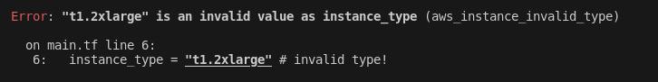

# terraform-pre-commit

## Pre-commit
https://pre-commit.com/

## pre-commit-terraform
Collection of git hooks for Terraform to be used with pre-commit
https://github.com/antonbabenko/pre-commit-terraform

# How to use it
1- Install pre-commit - https://pre-commit.com/#install
2- In your repository install git hook scripts
```
pre-commit install
```
Other option is install pre-commit hook globaly

```
DIR=~/.git-template
git config --global init.templateDir ${DIR}
pre-commit init-templatedir -t pre-commit ${DIR}
```
3- Create a .pre-commit-config.yaml file and add the hooks you need to validate your terraform commit.
check https://github.com/antonbabenko/pre-commit-terraform#available-hooks

4- Make a new commit and all your hooks will be executed!

The example has terraform_fmt, terraform_tflint and check-merge-conflict hooks. As you can see the file .tflint.hcl has a aws plugin. This plugin help you to validate some AWS rules like AWS instance types. 

In the following picture you can see an invalid instance type error



To test it uncomment the aws_instance resource in main.tf and try to commit the change.